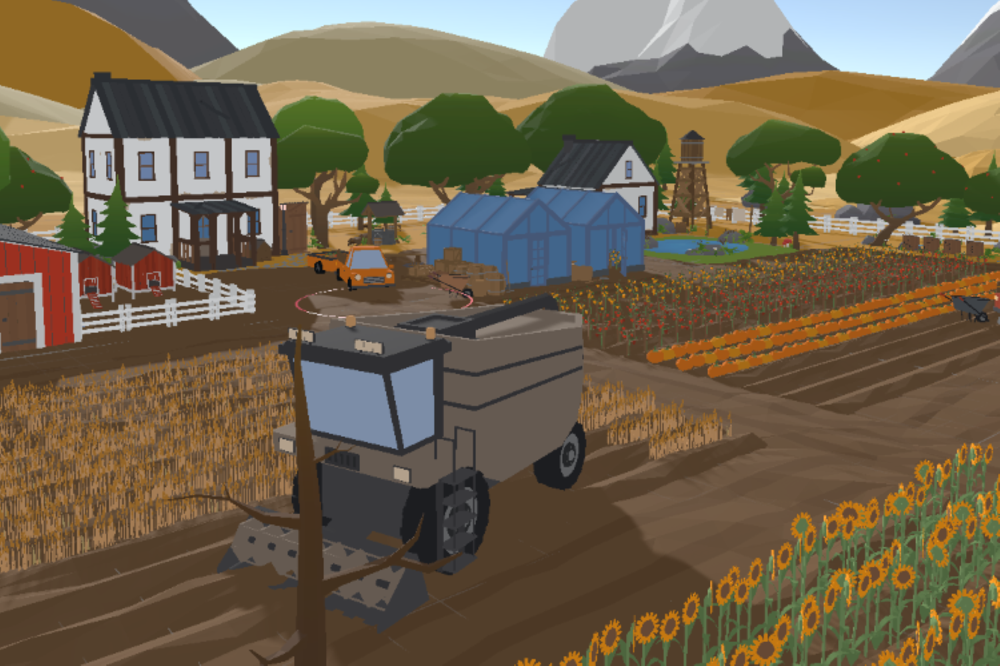

# ASVR_1.0
This is the initial prototype for a social VR project implemented in Unity and Engage SDK. The scene can be found under scene_bundles. The name of the scene is "ZU Farms". The project should be uploaded to a valid Engage XR account via the location manager in Unity. After the upload is complete it can be run as a session in Engage XR. The projecct fosters role-playing or acting in a story. Below is a brief description of the implemented scenario. (The second scenario is not implemented yet. It is a backup scenario to be implemented in the future if needed.)

<H1>The Improvisation Scenario for Immersive Learning in Social VR</H1>

Özgür Eren
     

<strong>Introduction</strong>

This document has been created for the project “Acting in Social VR for Immersive Learning”. The aim of the project is to create a social VR application in which students can educate themselves about climate crisis and the rising values of the right-extremism. In this document, the characters and the dramatic situation options for improvisation in social VR are given. Currently, the first option is being implemented. The second one has been written as an alternative for the first. After the initial test, the second option can also be implemented when needed. The idea is to generate one scene, in which the two main characters encounter a problematic situation. The two characters in this story, named Q and S, are inspired by the two characters from the classical novel Don Quijote. They are adapted to today’s conditions, and they are placed in a not-far-distant future, in an unknown land.

<strong>Two Main Characters</strong>

<i>Q:</i> A 48-year-old former data analyst who was fired because of the company’s decision to invest in AI rather than employing data analysts. An imaginative person who played online games for years. He is divorced and has a son who is a new university graduate living in another country. Q has moved to the countryside to make farming in their old family land. However, it did not take long for him to understand that things have changed here since he left the countryside 30 years ago. There is drought, the soil is polluted. Farming is not one of the best options in times of climate change. He needed help to solve the problem, and he found it nearby. In one of the neighbor farms, he met with a worker who looks for a steady job. This was S. Solving the water problem in their region would not only rescue Q’s own field, but it would also restore the broken reputation against his former lovely wife and son. Q has a special feature that he can see visions and cannot differ imagination from reality when he is overexcited.

<i>S:</i> He did not prefer to go to any kind of college because he was much better with his hands, just as his immigrant father had been for many years. He learned from him how to repair engines. He learned more about engines in his short education after secondary school, and then he started as a car manufacturer in a town nearby. He knows where and by whom to stand at the right time. He can think rationally when it comes to short term gains. S has a belly, likes to eat, drink and talk. He tells a lot about his abilities, that he could dismantle and reassemble a car engine in a day by himself. But no one has ever seen him doing something like this. That’s probably because he never likes to work more than needed. He is married to three children. Three lively girls who had not come of age yet. He could not have guessed that it would be so hard for the family when the factory decided to release 12000 workers to conduct the transition to the electric vehicle engines. Initially he thought that it would be easy for a 31-year-old, not-so-old man to get new skills. But he was terrible with computers other than watching videos on his phone. He accepted Q’s offer with great thanks, because this included a steady job, although he was not given a proper job description. They would find out what is wrong with the water supply and resupply water to the land.

Figure 1 Own picture from existing state

<strong>Dramatic Situation – 1:  The Field</strong>

<i>Location:</i> In an unknown country, there are two farms sharing a field in the countryside (Figure 1). There is a big water pump that does not regularly pump water anymore. Far away in the south there is a great AI-Server-Center. There are bushes and a small forest in the north.  

<i>Characters:</i> Two families of two farms. One of them tends to complain about the foreigners. The second family are immigrants coming from the south. Q, an imaginative farm owner coming from a distant village, has stopped by to understand the reason of the fight. S is a former car factory worker and the assistant of Q. One AI-Agent is charged with giving information about the recent water regulation and the advantages of the AI-Server-Center that has recently been erased in the countryside.    

<i>Conflict:</i> The Families are quarrelling for the right to achieve water for the field. Q tries to end the fight and receive support for his action against the AI-Center. S wants to fill the water reservoir in their vehicle and drink some water. There is thin line of smoke unnoticed in the forest. This smoke will grow thicker and darker during the scene.

<i>Background:</i> Due to the recent regulations, water can only be pumped to the fields between 12 PM and 1 PM. The region has been getting less rain than ever for ten years. Moreover, the newly built AI-Server-Center consumes a great amount of water from the river. These regulations are needed to sustain agricultural activity. The crops in the field need urgent watering, if not, they will rotten before they grow ripe.

<strong>Dramatic Situation - 2: The Windmills</strong> 

<i>Location:</i> The skirts of a good-looking town with a world-famous plastic factory. The three recently built windmills are running fast because of the strong wind. There is a construction site set around the windmills, but the work has not started yet. 

<i>Characters:</i> The mayor, one worker from the construction site, two people who are against the windmills (one elderly, one young adult), one young advocate who tries to pause the procedure, Q and S who were passing by and are trying to understand the reason of the conflict.

<i>Conflict:</i> The elites of the town want to get rid of these giant creatures, because they think that the windmills destroy the beautiful landscape. The windmill supporter just tries to gain some time and pause the procedure. Q tries to calm down the people, who were about to get into a fight. When he learns that the town elite want to “tear off” the windmills, he gets angry, because he is a true fan of windmills as a source of alternative energy.

<i>Background:</i> The aim of the construction is to dismantle the windmills, because the newly elected town council has decided to do so to meet the expectations of the increasing number of far-right votes in the town. On the other hand, there is a trial procedure that started a week ago. The court order to stop the dismantling has not arrived yet, but it is a matter of time, according to the supporters of the windmill.

